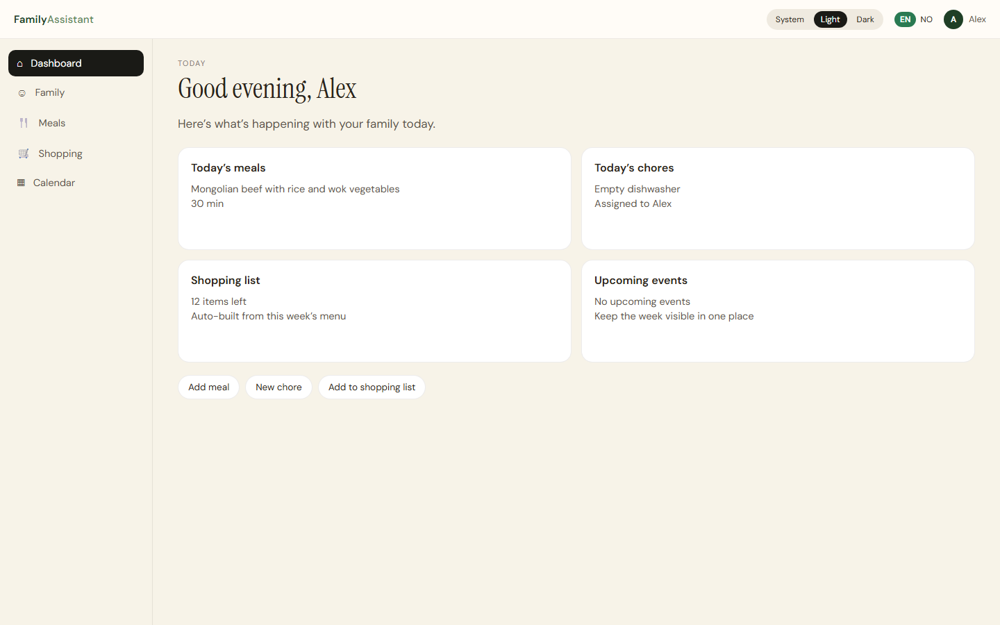
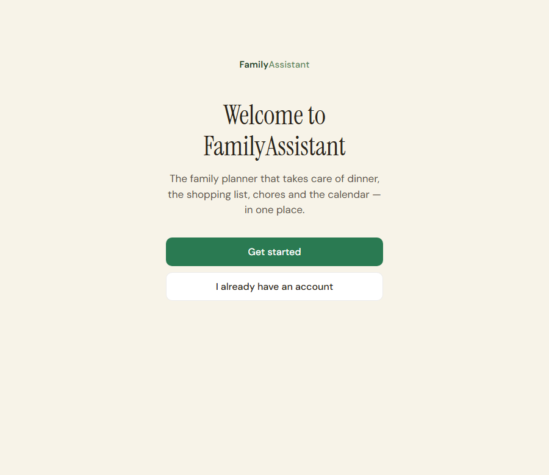
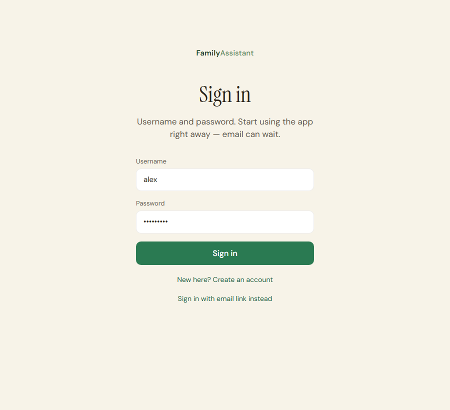
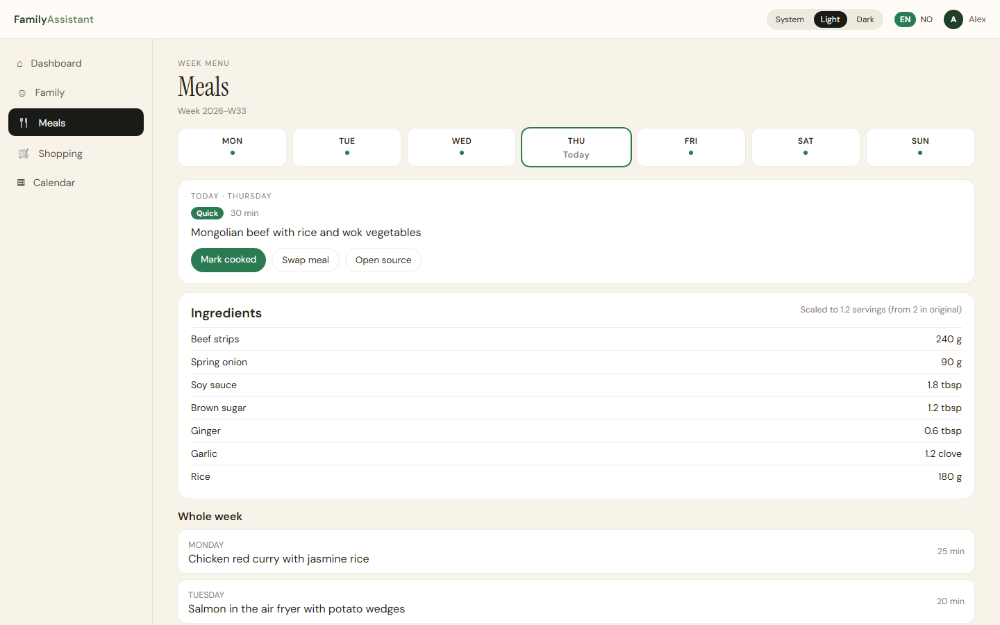
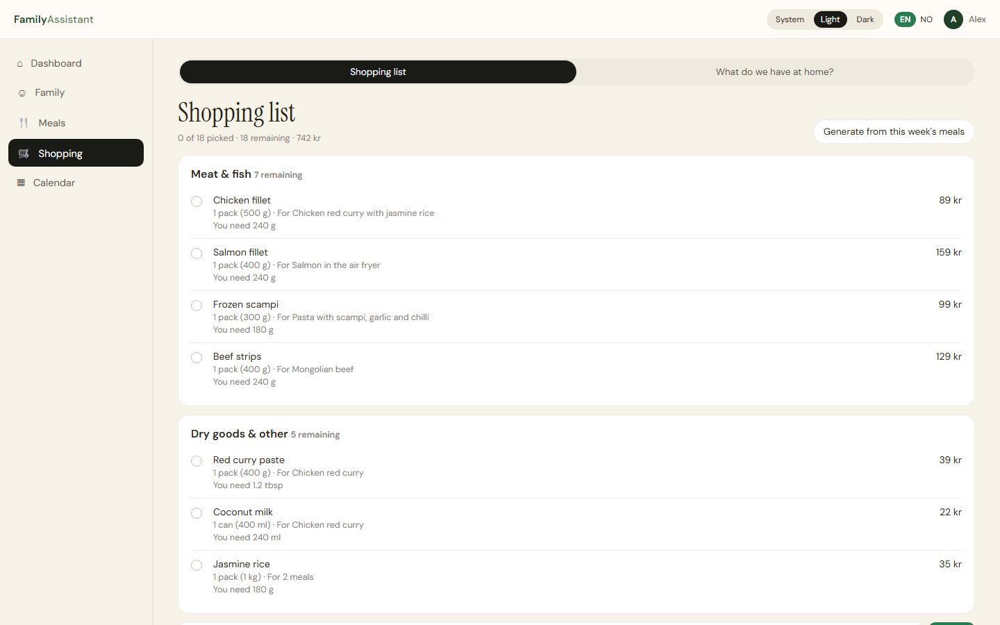
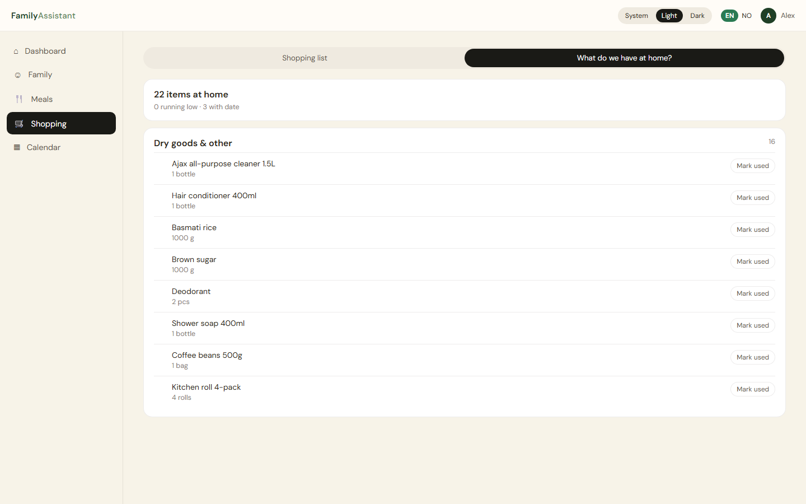

# FamilyAssistant

Self-hosted household assistant for meals, shopping, pantry and chores. One app for the family, running on your own hardware — typically a Raspberry Pi 5 behind Portainer and Cloudflare Tunnel.

The UI is Norwegian and English. This repository is documented in English.

<p align="center">
  
</p>

## Why it exists

FamilyAssistant keeps dinner planning, the shopping list, what is already in the cupboard, and weekly chores in one place. It is built to stay on a machine you control: SQLite on disk, no required cloud account, optional AI when you want it.

Typical deploy: **Docker → Portainer → Raspberry Pi (or any host) → optional Cloudflare Tunnel**.

## Features

- **Weekly menu** with per-member portion scaling
- **Shopping list** generated from the week plan, aware of what is already at home
- **Pantry** with shelf-life tracking and “mark as used”
- **Chores** with schedules and a completion log
- **Recipe import** from URLs (optional LLM parsing)
- **Allergy and diet filters** (model context plus a deterministic post-filter)
- **Username/password sign-in**, with optional email verification later; magic-link and Google OAuth remain available
- **Multi-tenant families** with `owner` / `adult` / `child` roles
- **Per-family LLM** — Anthropic, OpenAI, xAI, or Ollama; keys encrypted at rest (AES-256-GCM)
- **PWA** — installable on the phone, offline reads for core lists
- **GDPR** — export, 30-day soft-delete, cascade-delete when a family is removed
- **White-label** — same image, different name and colours via environment variables

## Current surfaces

What G0 actually ships in the UI (open the site root, not `/v2`):

| Surface | Status |
|---|---|
| Dashboard | Today meals, chores, upcoming local events |
| Meals | Week plan + Open library → `/recipes` |
| Recipes | Read-only family library (create/edit in a later phase) |
| Shopping / Pantry | Full |
| Calendar | Local family events (no Google) |
| Chores | Dashboard card + complete/undo API; no family create UI yet |
| Settings | GDPR export + delete account |
| Auth | Username/password; LAN: `HTTPS_TERMINATED` must stay `false` |

## Screenshots

All screens below use the English UI (switch to Norwegian in the header).

<p align="center">
  
  &nbsp;
  
</p>







Capture notes live in [`docs/screenshots/README.md`](docs/screenshots/README.md).

## Quick start

### Docker / Portainer (recommended)

```bash
# Portainer → Stacks → Add stack
# Repository: https://github.com/ChristerFrestad/FamilyAssistant
# Compose path: docker-compose.yml
# Reference:   refs/heads/main
```

Then open `http://<host>:7777/`. On a brand-new volume the setup wizard at `/setup.html` creates secrets for you. After that, create a username and finish the family profile.

Image: `ghcr.io/christerfrestad/familyassistant:main` (linux/amd64 + linux/arm64).

LAN access is plain HTTP on port **7777**. Leave `HTTPS_TERMINATED` unset/`false` unless a reverse proxy terminates TLS and sends `X-Forwarded-Proto: https` (Cloudflare Tunnel does). Forcing `HTTPS_TERMINATED=true` on raw HTTP drops the session cookie and sign-in appears to work until the next request.

### Local development

```bash
git clone https://github.com/ChristerFrestad/FamilyAssistant.git
cd FamilyAssistant
npm ci

# Terminal 1 — API on :7777
npm start

# Terminal 2 — Vite on :7778, /api proxied to the backend
npm run dev:client
```

Open [http://localhost:7778/](http://localhost:7778/). Production-style: `npm run build:client && npm start` and open [http://localhost:7777/](http://localhost:7777/).

The app lives at the site root (`/`, `/login`, `/dashboard`, `/recipes`, `/calendar`). `public/v2/` is the Vite **build folder**, not a URL. Older `/v2/...` bookmarks 301 to the same path without the prefix.

## How the repo is organised

| Path | Role |
|---|---|
| `server/` | Node `http` API, auth, SQLite, cron, LLM adapters |
| `client/` | Vite + React + TypeScript UI |
| `public/` | Legal pages, setup wizard, built UI (`public/v2/` is the **build folder**, not a URL) |
| `tests/` | Node test runner coverage for the server |
| `docs/` | Architecture, operations, screenshot kit |
| `docker-compose.yml` | Zero-config Portainer stack |

## Stack

- Node.js 20–22, no web framework — `node:http` + a small router
- SQLite via `better-sqlite3` (optional `sql.js` fallback)
- Zod, pino, Vite, React 19, TypeScript, Tailwind
- Auth: session cookie (`fa_session`, HttpOnly, SameSite=Lax; `Secure` only on HTTPS)
- CI: lint, format, typecheck, tests, coverage gate, npm audit, SBOM, OSV

One Raspberry Pi is enough for tens of families: one SQLite process,
`busy_timeout=5000`, and a single retry on `SQLITE_BUSY`. The gate is
`scripts/load-four-families.js` — four families, 20 parallel mixed
writes each; any 5xx or `SQLITE_BUSY` exits 1. CI embeds the test
server (`node --test tests/load-four-families.test.js`); against a
live Pi use `BASE_URL=http://host:7777 node scripts/load-four-families.js`.
See [RUNBOOK.md](RUNBOOK.md) §8.6.

## Documentation

| Doc | What it covers |
|---|---|
| [`DEPLOY.md`](DEPLOY.md) | Raspberry Pi and Portainer deploy |
| [`RUNBOOK.md`](RUNBOOK.md) | Day-2 operations, backup, recovery |
| [`SECURITY.md`](SECURITY.md) | Threat model and how to report vulnerabilities |
| [`CI.md`](CI.md) | Local and GitHub Actions gates |
| [`CONTRIBUTING.md`](CONTRIBUTING.md) | Issues, branches, review |
| [`CHANGELOG.md`](CHANGELOG.md) | What changed |
| [`docs/ARCHITECTURE.md`](docs/ARCHITECTURE.md) | How the process is put together |
| [`docs/BRAND_SYSTEM.md`](docs/BRAND_SYSTEM.md) | White-label tokens |

## Production checklist

Docker zero-config creates `AUTH_TOKEN` and `SESSION_SECRET` on first boot. If you run bare-metal with `NODE_ENV=production`:

1. `AUTH_TOKEN` — at least 16 characters (`openssl rand -hex 32`)
2. `ALLOWED_ORIGINS` — explicit origins; `*` is rejected in production
3. HTTPS in front of the process **or** LAN HTTP without `HTTPS_TERMINATED=true`
4. For email / OAuth: `SESSION_SECRET`, `APP_URL`, and provider keys as needed

## License

MIT — see [`LICENSE`](LICENSE). © Christer Frestad.

Security reports: [`SECURITY.md`](SECURITY.md), not a public issue.
